# 1. 前言
前面我在网上更新了如何使用ROS1和gazebo搭建宇树机器狗的仿真环境，而ROS1已经于今年退出了持续维护行列，ROS2的使用人群越来越多其生态在逐渐完善，为了能更好的完成在ROS2上的一些开发，我来填宇树机器狗GO2-ROS2-Gazebo仿真环境搭建的这个坑了。与早前宇树机器狗go2-gazebo仿真环境搭建一样，在多台电脑上进行了测试,且本次会搭建也配备了docker来帮助大家更快的完成环境的搭搭建，后续的GO2实机教程应该也会慢慢端上来（再次挖坑，本次在两个台22.04的电脑上进行了直接测试，一台是CPU i5 13490f 显卡4070的台式机，一台是CPU i7 13650HX 显卡5070的笔记本电脑，其实有docker后ubuntu的版本就没那么重要了）。
同时我也希望能有更多的开发者加入近来一起完成机器狗go2的仿真实验项目的建设，如有更好的方案和建议可以私聊或申请共创作者

注释：本次项目借鉴了网上的开源项目进行整合，一切功劳的都是原作者的，我只是在他们的基础上进行了简单的整合和配置。
# 2. 实验前准备
刚入门的小伙伴选择使用本机部署环境的话需按顺序进行操作，但如果您是老鸟或选择使用的docker进行部署可选择性跳转到相应位置
## 2.1 ROS2安装
确保在配置环境前已未安装好经安装好了ROS2,如若先前未安装则需要在终端中输入下面的小鱼的一键安装脚本。
```bash
wget http://fishros.com/install -O fishros && . fishros
```

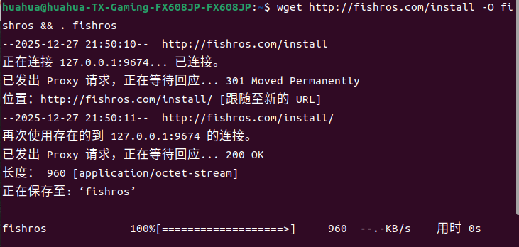

键盘输入1后选择ROS一键安装，回车。

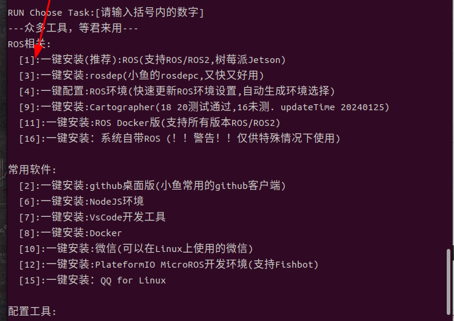

若是第一次安装可以选择换源。

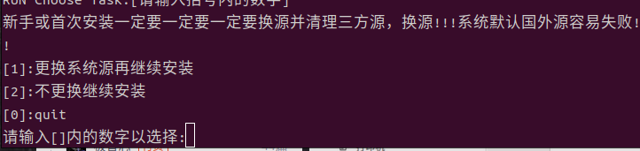

选择ROS2 Humble,本次环境部署是基于Ubuntu22.04，可选择的就是ROS2 Humble。

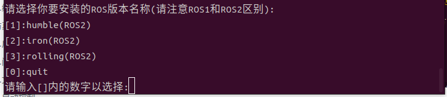

建议选择桌面版

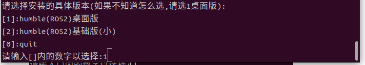

后续就可以等待安装完毕了

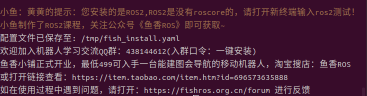

可在终端中输入ros2来进行检测是否安装成功。
```bash
ros2
```
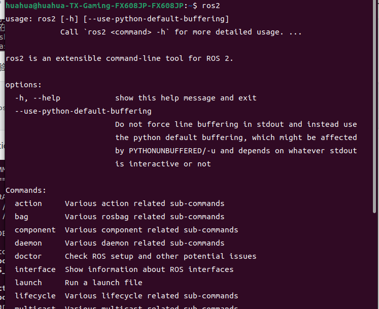

到这里ROS2 Humble的安装就完成了。
## 2.2 docker安装和docker构建流程
参考我的文章[docker搭建指南](https://ai.feishu.cn/wiki/GmzDwb2egiPGo1kUFX2csYKWnIb)。
## 2.3 nvida驱动和cuda安装
### 2.3.1 nvidia驱动安装
终端中输入
```bash
ubuntu-drivers devices
```
你将看到一系列适合安装的nvidai驱动，一般情况下会推荐安装带有recommended标识的，但带recommended的驱动往往都太新了，我会推荐选择安装前一到两个版本的驱动，这里我选择的就是570的驱动。


```bash
sudo apt install nvidia-driver-570
```
在安装过程中如果遇到 ***Secure Boot（安全启动）*** 触发的 MOK（机器所有者密钥）配置提示的话，正常注册密钥就好，但一定要记得当前的密钥，后面要用。

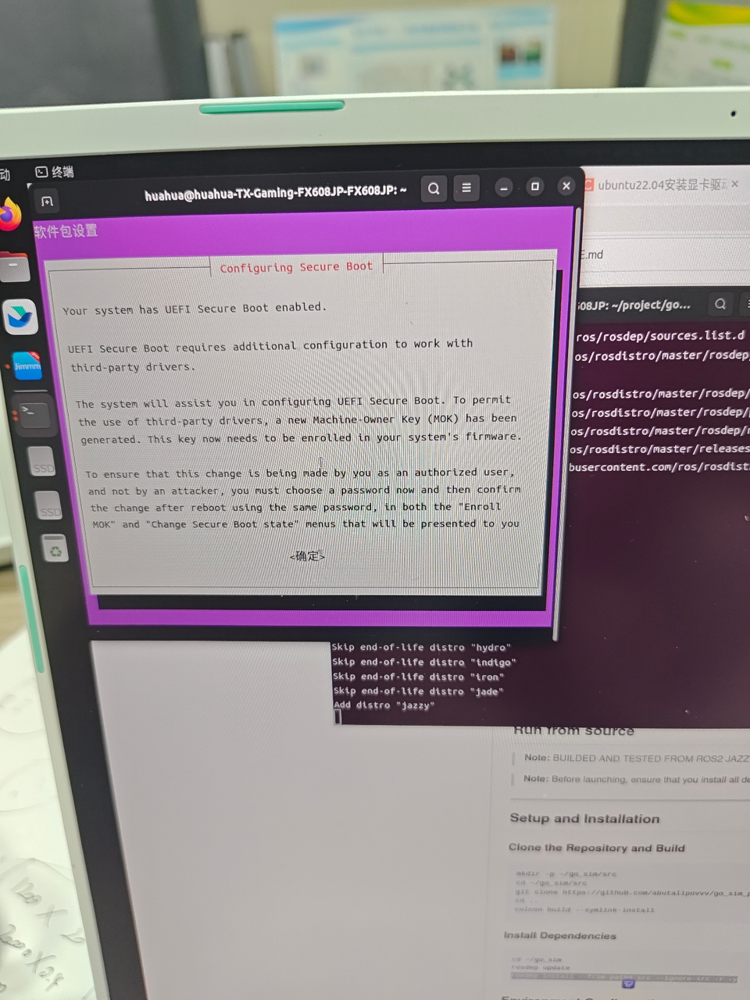

完成安装后，在终端中输入sudo reboot完成电脑重启。
```bash
sudo reboot
```
重启后会进入MOK管理界面（蓝色的的UEFI界面），选择Enroll MOK，然后选择Continue，随后选择YES，输入先前注册的密钥，选择reboot重启电脑

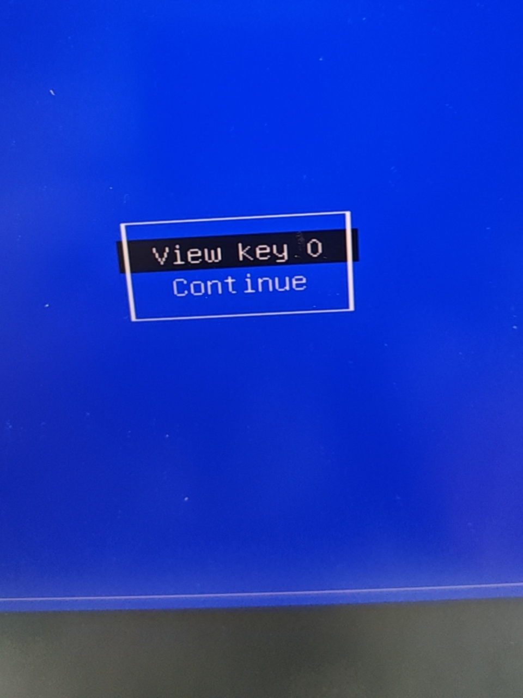

重启完成后在电脑中输入nvidia-smi查看驱动是否安装完成。
``` bash
nvidia-smi
```

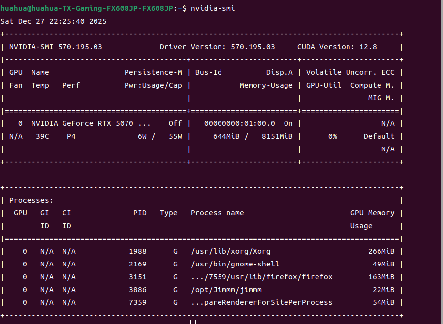

### 2.3.2 cuda安装
这里是cuda的连接https://developer.nvidia.com/cuda-toolkit-archive，选择适合的cuda版本进行安装就好，不推荐使用过新的cuda版本，我选择的就是cuda 12.8。


选择好自己的安装需求后，按着官方给出的指令一步步进行安装就好

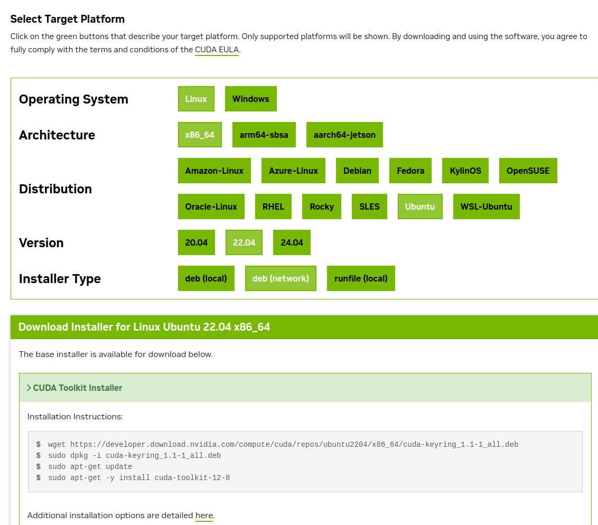

随后在终端中输入，注意我的cuda版本为12.8,而你的不一定是。
```bash
echo 'export PATH=/usr/local/cuda-12.8/bin:$PATH' >> ~/.bashrc
echo 'export LD_LIBRARY_PATH=/usr/local/cuda-12.8/lib64:$LD_LIBRARY_PATH' >> ~/.bashrc
```
随后在终端中输入
```bash
nvcc -V
```
出现下面内容则安装成功。


### 2.3.3 问题与解决
如果遇到安装完nvidia驱动和cuda后导致屏幕亮度无法调节的问题，可按下面的步骤进行解决。
在终端中输入
```bash
sudo gedit /etc/default/grub
```
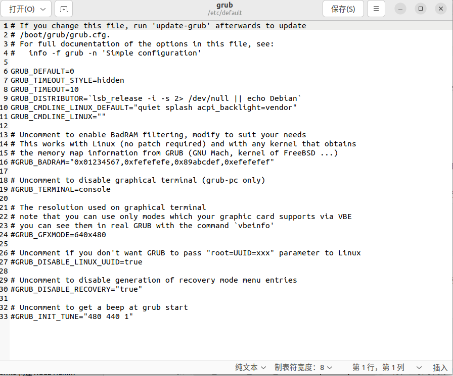

找到GRUB_CMDLINE_LINUX_DEFAULT，在其后面添加：笔记本常用acpi_backlight=vendor，通用适配acpi_backlight=native。
```bash
GRUB_CMDLINE_LINUX_DEFAULT="quiet splashr"
# 改成
GRUB_CMDLINE_LINUX_DEFAULT="quiet splash acpi_backlight=vendor"
```
保存文件，在终端中输入
```bash
sudo update-grub
sudo reboot
```
随后应该就能调节屏幕亮度了。
## 2.4 依赖安装
```bash
sudo apt install -y ros-humble-controller-manager ros-humble-hardware-interface ros-humble-joint-state-publisher ros-humble-slam-toolbox ros-humble-navigation2 ros-humble-nav2-bringup ros-humble-rqt-robot-steering ros-humble-rmw-cyclonedds-cpp ros-humble-cyclonedds ros-humble-velodyne-description ros-humble-tf-transformations ros-humble-opennav-docking ros-humble-robot-localization ros-humble-ros2-controllers ros-humble-gazebo-ros ros-humble-gazebo-plugins ros-humble-gazebo-dev ros-humble-ros-ign ros-humble-ign-ros2-control ros-humble-gz-ros2-control
```
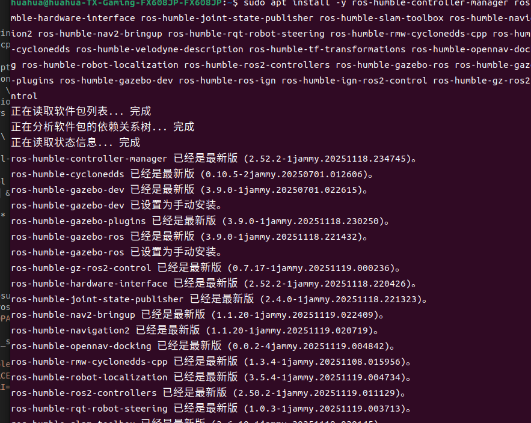

ok，接下来我们就可以正式部署环境了。
# 3. 项目获取
## 3.1 Github获取项目
```bash
git clone https://github.com/yanyuze1/ROS2-Gazebo-GO2.git
```
## 3.2 Gittee获取项目
```bash
https://gitee.com/yanyu-sauce/ROS2-Gazebo-GO2.git
```
# 3.3 飞书获取项目
通过链接进入我的飞书，选择go2_sim_ws.zip下载即可，这是一个更为轻便的工作空间，后续会尽可能的在此基础上进行更新和添加功能，如选择了go2_sim_ws（含cafe场景）.zip则需要执行一下 ***export GZ_SIM_RESOURCE_PATH=~/project/go2_sim_ws/src/gazebo_sim/models***
 [飞书链接](https://ai.feishu.cn/docx/WmUod7tztoab1rxPFVEc6nsLnIE)


# 4. 项目使用
## 4.1 直接编译使用
进入到工作空间
```bash
cd go2_sim_ws
colcon build
soure install/setup.bash
export CYCLONEDDS_URI=file://~/go2_sim_ws/src/docker/cyclonedds.xml
```

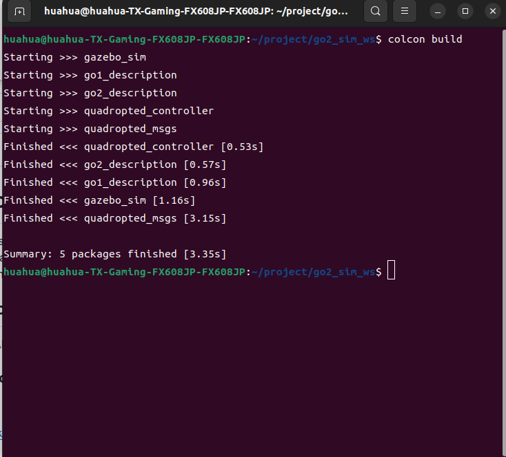

启动，第一次启动会比较久，因为需要下载相应的场景资源。
```bash
ros2 launch gazebo_sim launch.py
```
成功启动后会如下图所示。


本项目配备了一个狗的前置普通单目摄像头用以模拟GO2本身的前置摄像头，同时配备了两个激光雷达，一个为模拟GO2的前置L1激光雷达，一个为模拟外界的VLP16激光雷达，两个激光雷达都可同时发布LaserScan类型数据和PointCloud2类型数据，为后续的建图和导航工作提供了便利，而后续也会更新加入D435i摄像头。
```bash
cd go2_sim_ws
source install/local_setup.bash
ros2 run teleop_twist_keyboard teleop_twist_keyboard --ros-args -r /cmd_vel:=/robot1/cmd_vel
```
在终端中执行上述命令后就可以使用键盘对其进行简单的控制了，同时可以使用下面的服务完成对机器狗的控制,支持的服务有walk、up、sit，分别对应走、站、趴。
```bash
ros2 service call /robot1/robot_behavior_command quadropted_msgs/srv/RobotBehaviorCommand "{command: 'walk'}"
```
## 4.2 docker使用
在使用docker前请简单的阅读docker搭建流程指南，因为每个人的情况还是会有些许差别，而为我使用的是外挂卷的形式完成的任务。
使用下面的命令可以很快的帮您完成想要的操作。
```bash
cd go2_sim_ws/src/docker
docker compose up -d --build --remove-orphans        #容器构建
docker compose up -d go2_sim                        #启动容器，-d为不进入docker终端,ros2_sim是众多服务中的一个服务
docker compose ps                                    #容器查看
docker compose exec go2_sim bash                    #进入容器
docker compose down                                  #容器删除
```
进入到docker后，可以按照前面直接安装的操作来
```bash
colcon build
soure install/setup.bash
```
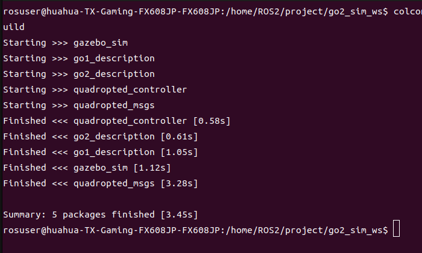

启动，第一次启动会比较久，因为需要下载相应的场景资源。
```bash
ros2 launch gazebo_sim launch.py
```
成功启动后会如下图所示。

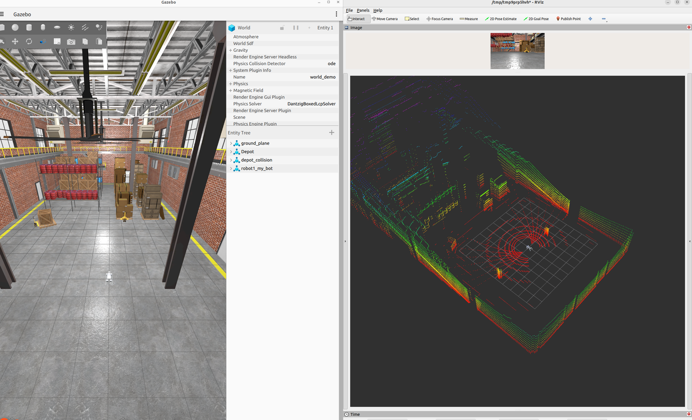

本项目配备了一个狗的前置普通单目摄像头用以模拟GO2本身的前置摄像头，同时配备了两个激光雷达，一个为模拟GO2的前置L1激光雷达，一个为模拟外界的VLP16激光雷达，两个激光雷达都可同时发布LaserScan类型数据和PointCloud2类型数据，为后续的建图和导航工作提供了便利，而后续也会更新加入D435i摄像头。
```bash
cd go2_sim_ws
source install/local_setup.bash
ros2 run teleop_twist_keyboard teleop_twist_keyboard --ros-args -r /cmd_vel:=/robot1/cmd_vel
```
在终端中执行上述命令后就可以使用键盘对其进行简单的控制了，同时可以使用下面的服务完成对机器狗的控制,支持的服务有walk、up、sit，分别对应走、站、趴。
```bash
ros2 service call /robot1/robot_behavior_command quadropted_msgs/srv/RobotBehaviorCommand "{command: 'walk'}"
```
# 5. 后言
ok本次更新到此，有关后续的内容会在后续的博客文章中进行更新和补充，当前机会为添加D435摄像头，讲解ignition gazebo和gazebo classic的区别，更换仿真场景，2d建图和导航，3d建图和导航，实机部署系列，VLN等后续更新计划。感谢各位，尤其感谢为本次项目提供了基本框架和思路的开源项目的大佬们。
